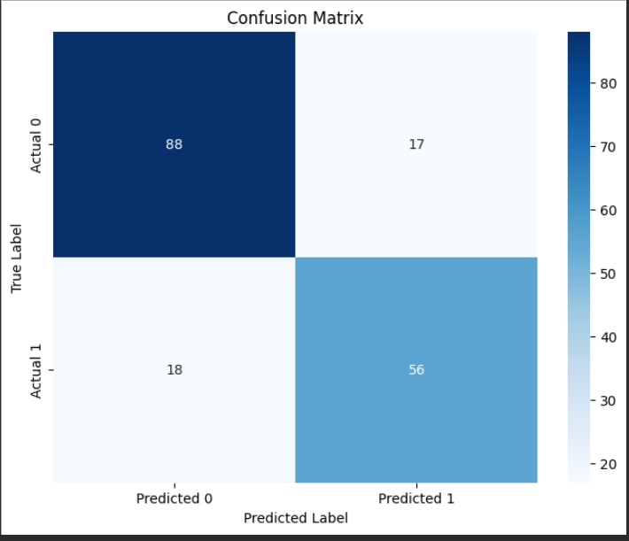
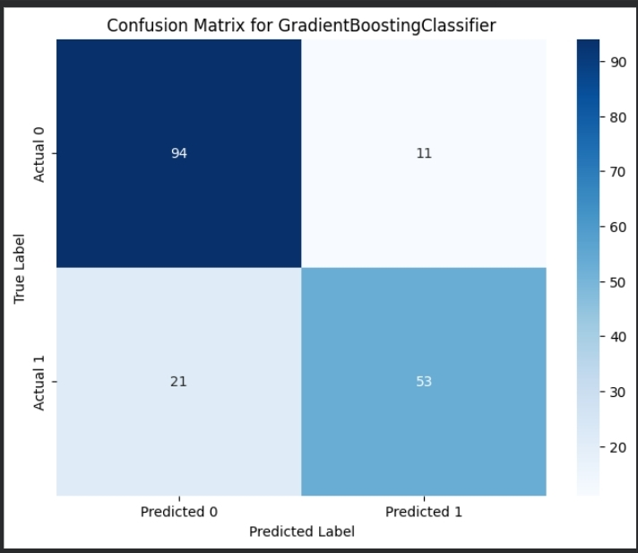

# Titanic Survival Prediction

راط الكود على kaggle [هنا](https://www.kaggle.com/code/majdteleyan/titanic-gradientboosting)
### "التطبيق العملي هو أفضل معلم" 
في هذا المشروع قمت بتحليل بيانات سفينة التيتانيك الشهيرة للتنبؤ باحتمالية نجاة الركاب بناءً على عدة عوامل.

---

## 🧐 فلسفة المشروع (Methodology)
لم أكتفِ ببناء نموذج عشوائي، بل اتبعت منهجية تعتمد على التجربة والمقارنة :
1. **البداية:** قمت ببناء نموذج باستخدام **Random Forest** كخوارزمية أساسية قوية.
2. **التحدي:** بعد رؤية النتائج الأولية، قررت إجراء مقارنة شاملة بين عدة خوارزميات للوصول لأقصى دقة ممكنة (Accuracy).
3. **النتيجة:** بعد تحليل النتائج، وجدت أن خوارزمية **GradientBoostingClassifier** هي الأفضل والأنسب لطبيعة هذه البيانات، حيث حققت توازناً ممتازاً وتنبؤاً أدق.

4. <table>
  <tr>
    <td style="padding-right:50px"></td>
    <td style="padding-right:50px"></td>
  </tr>
</table>

---

## 🛠 الخطوات التقنية (Pipeline)
1. **معالجة البيانات (Cleaning):**
   - التعامل مع القيم المفقودة (Null values) في أعمدة العمر والمنفذ.
   - تحويل البيانات النصية (مثل الجنس) إلى قيم رقمية (Label Encoding).
2. **تحليل البيانات:**
   - دراسة العلاقة بين طبقة الركاب (Pclass) وفرص النجاة.
   - فهم تأثير الفئات العمرية والجنس على النتائج.
3. **بناء المودل (Modeling):**
   - تدريب عدة نماذج ومقارنتها.
   - اختيار **Gradient Boosting** بناءً على مقاييس الأداء.

---

## 📊 النتائج المستخلصة
- **أفضل دقة (Best Accuracy):** تم تحقيقها بواسطة `GradientBoostingClassifier`.
- **الاستنتاج:** الخوارزميات التي تعتمد على تحسين الخطأ المتسلسل (Boosting) كانت أكثر كفاءة في التعامل مع تعقيدات البيانات في هذا المشروع مقارنة بالخوارزميات الأخرى.

---

## 💻 الأدوات المستخدمة 
- **Python** (الأساسية)
- **Pandas & NumPy** (لمعالجة البيانات)
- **Matplotlib & Seaborn** (للرسم البياني)
- **Scikit-learn**
